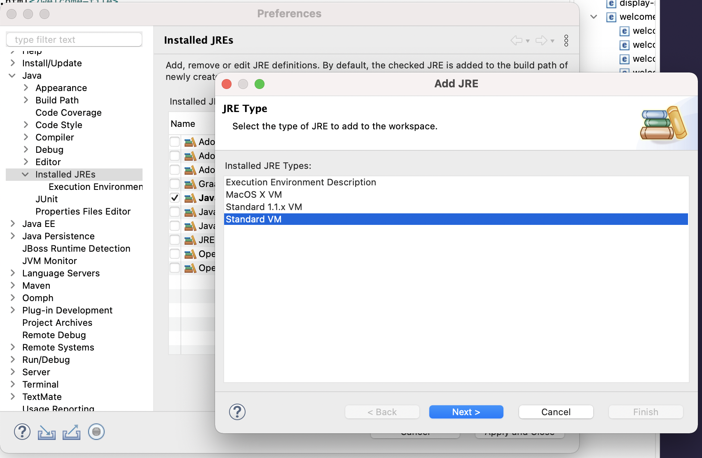
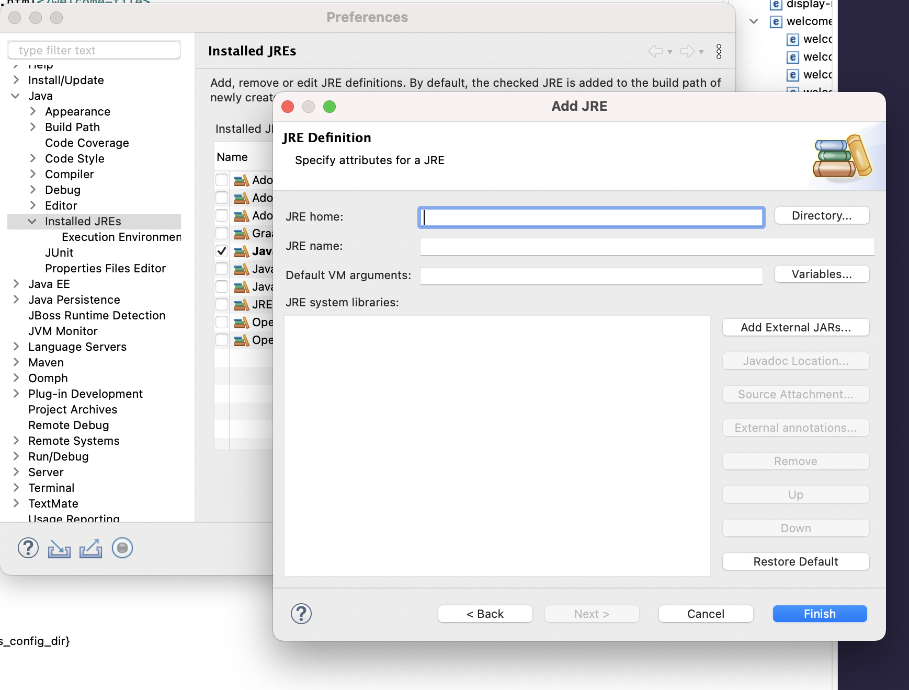
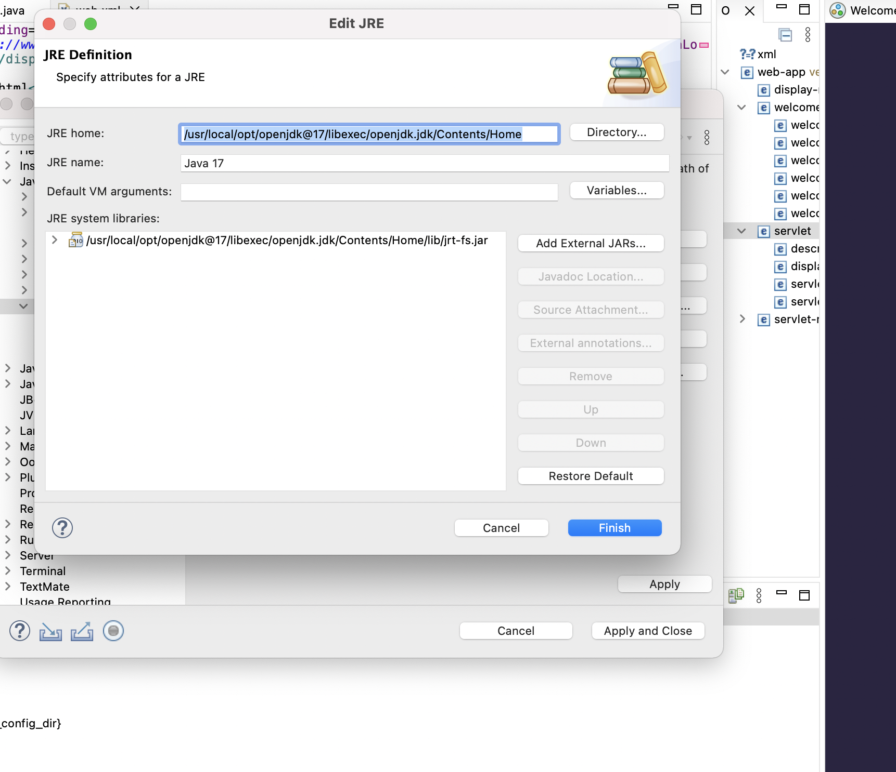
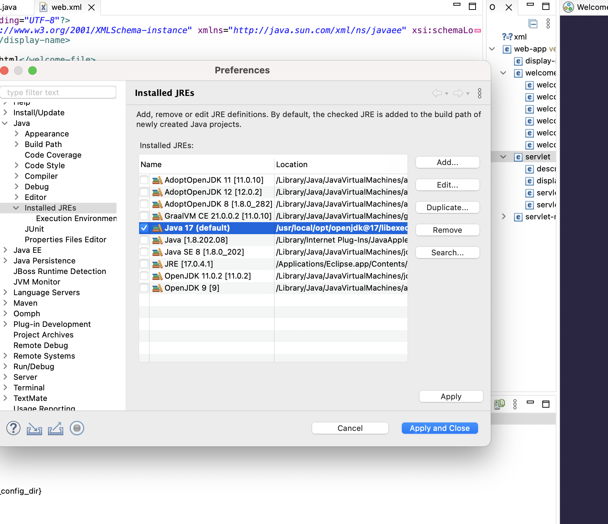
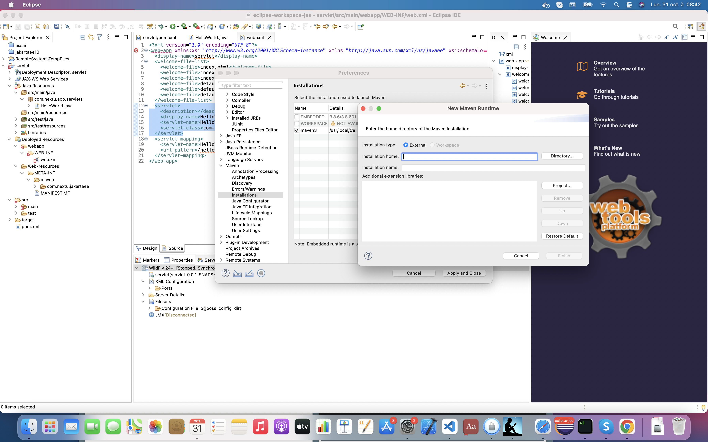
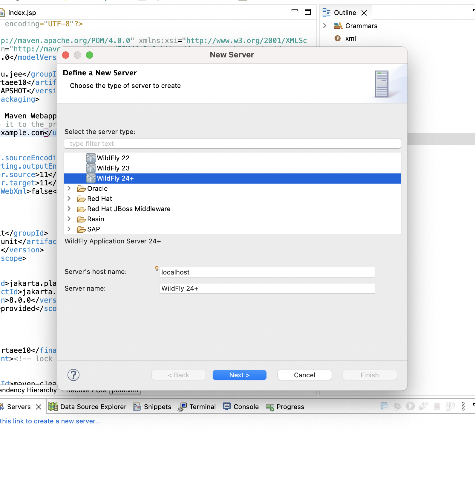
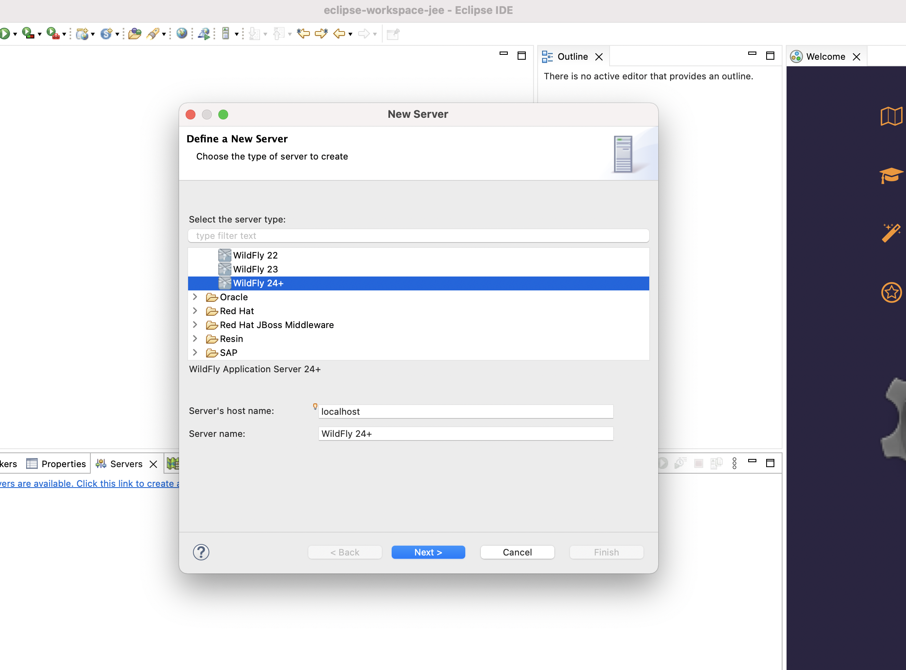
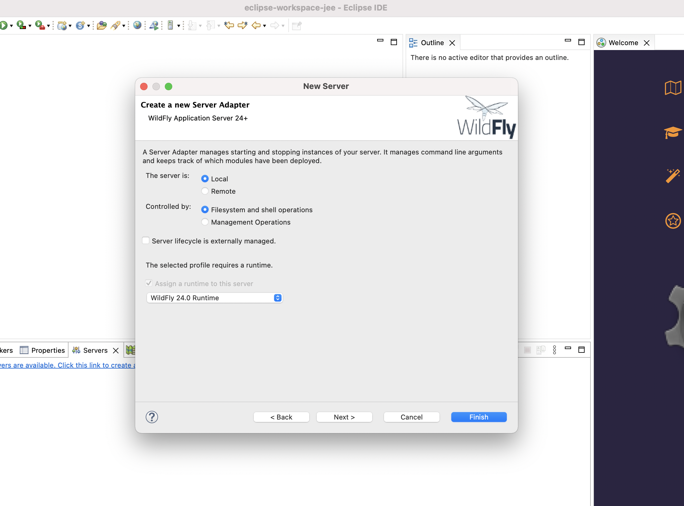
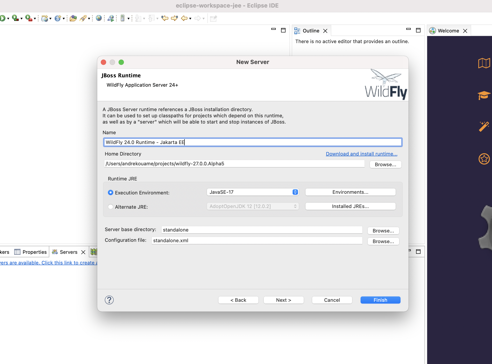

# Configuration de votre environnement de travail

Pré-requis:
-----------
- Java SE 17
- Maven 3
- Eclipse Java EE Developer
- Widfly 27

I - Configuration de la JDK dans Eclipse.
-----------------------------------------

Depuis le menu Window > preferences. Selectionner l'élément Java > Installed JRE. Cliquez ensuite sur le bouton add. Vous verrez apparaître une fenêtre comme sur la capture ci-dessous.Cliquez enfin sur le bouton next

Cliquez sur le bouton add pour definir votre JVM.
- Selectionnez le chemin de votre JDK au moyen du bouton directory du formualire
- Nommez votre JRE, dans le champ JRE Name

Une fois selectionné vous devriez avoir un resultat similaire, à celui affiché par l'ecran ci-dessous

Enfin cochez votre JVM dans la liste ci-dessous

III - Configuration de maven.
----------------------------------------

Depuis le menu Window > preferences. 

Selectionnez l'élément installation en dessous du menu maven et cliquez ensuite sur le bouton add. Enfin au moyen du bouton directory selectionnez le repertoire d'installation de maven et donnez un nom à votre installation cliquez sur le bouton finish et selectionnez votre element dans la liste des éléments maven affichés comme sur la capture d'écran.

III - Configuration du serveur Widfly.
----------------------------------------

Depuis l'onglet Servers d'Eclipse (Pour le faire apparaître allez dans Window > show view > Servers). Cliquez sur le lien create a new server

Deroulez le dossier JBoss Community et choisissez le serveur Widfly 24+ et cliquez ensuite sur le bouton next

Assurez vous que vous avez les éléments selectionnées comme sur la capture d'écran et ensuite cliquez sur le bouton next

Enfin nommez votre serveur et selectionnez son chemin d'installation au moyen du bouton browse

